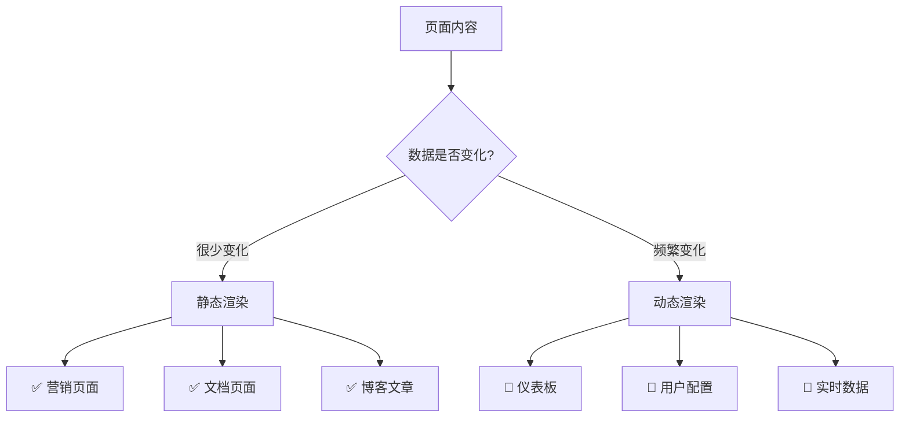

# 静态和动态渲染文档

## 概述
本文档详细分析 Next.js 仪表板项目中的静态渲染和动态渲染实现，展示不同渲染策略的应用场景和性能影响。

## 渲染策略概览

### Next.js App Router 渲染模式
```
静态渲染 (Static Rendering)
├── 构建时预渲染
├── CDN 缓存优化
└── 适用于静态内容

动态渲染 (Dynamic Rendering)
├── 请求时渲染
├── 服务器端执行
└── 适用于个性化内容
```

## 项目中的渲染实现

### 1. 静态渲染页面

#### 主页 (`app/page.tsx`)
```typescript
// app/page.tsx:8-58
export default function Page() {
  return (
    <main className="flex min-h-screen flex-col p-6">
      {/* 静态内容：Logo、文案、图片 */}
      <div className={styles.shape}>
        <AcmeLogo />
      </div>
      <p className={`${lusitana.className} text-xl text-gray-800`}>
        <strong>Welcome to Acme.</strong> This is the example...
      </p>
      <Image
        src="/hero-desktop.png"
        width={1000}
        height={760}
        className="hidden md:block"
        alt="Screenshots of the dashboard project"
      />
    </main>
  );
}
```

**静态渲染特征：**
- ✅ 无异步数据获取
- ✅ 无外部依赖
- ✅ 构建时预渲染
- ✅ 优化的图片处理

#### 简单页面 (`app/dashboard/invoices/page.tsx`)
```typescript
// app/dashboard/invoices/page.tsx:1-3
export default function Page() {
  return <p>invoices</p>;
}
```

**静态渲染特征：**
- ✅ 纯静态内容
- ✅ 零数据依赖
- ✅ 极快的加载速度

### 2. 动态渲染页面

#### 仪表板页面 (`app/dashboard/page.tsx`)
```typescript
// app/dashboard/page.tsx:11-41
export default async function Page() {
  // 🔄 动态数据获取
  const revenue = await fetchRevenue();
  const latestInvoices = await fetchLatestInvoices();
  const {
    numberOfInvoices,
    numberOfCustomers,
    totalPaidInvoices,
    totalPendingInvoices,
  } = await fetchCardData();

  return (
    <main>
      {/* 基于数据库数据的动态内容 */}
      <Card title="Collected" value={totalPaidInvoices} type="collected" />
      <Card title="Pending" value={totalPendingInvoices} type="pending" />
      <RevenueChart revenue={revenue} />
      <LatestInvoices latestInvoices={latestInvoices} />
    </main>
  );
}
```

**动态渲染特征：**
- 🔄 `async` 函数组件
- 🔄 数据库查询依赖
- 🔄 请求时渲染
- 🔄 实时数据展示

## 性能演示和分析

### 数据获取延迟演示
在 `app/lib/data.ts` 中包含性能演示代码：

```typescript
// app/lib/data.ts:19-20,24
export async function fetchRevenue() {
  try {
    console.log('Fetching revenue data...');
    await new Promise((resolve) => setTimeout(resolve, 3000));

    const data = await sql<Revenue[]>`SELECT * FROM revenue`;

    console.log('Data fetch completed after 3 seconds.');
    return data;
  } catch (error) {
    // 错误处理
  }
}
```

### 渲染性能影响分析

#### 🐌 动态渲染性能影响
```
用户请求 → 服务器处理 → 数据库查询 → 3秒延迟 → 渲染完成 → 响应返回
    ↓
总响应时间：3+ 秒
```

#### ⚡ 静态渲染性能优势
```
用户请求 → CDN缓存命中 → 立即响应
    ↓
总响应时间：< 100ms
```

## 渲染模式决策树

### 何时使用静态渲染


### 项目页面分类

#### 📋 静态渲染页面
1. **主页** (`/`)
   - 内容：欢迎页面、Logo、静态图片
   - 优势：极快加载、SEO友好、CDN缓存

2. **简单功能页** (`/dashboard/invoices`)
   - 内容：占位符内容
   - 优势：零延迟、构建时优化

#### 🔄 动态渲染页面
1. **仪表板** (`/dashboard`)
   - 内容：实时收入图表、最新发票、统计卡片
   - 数据源：PostgreSQL 数据库
   - 更新频率：每次请求

## 性能优化策略

### 静态渲染优化

#### 图片优化
```typescript
// app/page.tsx:40-53
<Image
  src="/hero-desktop.png"
  width={1000}
  height={760}
  className="hidden md:block"
  alt="Screenshots of the dashboard project"
/>
```

**优化特性：**
- ✅ 自动 WebP 格式转换
- ✅ 响应式图片尺寸
- ✅ 懒加载 (Lazy Loading)
- ✅ 优化的压缩算法

#### 字体优化
```typescript
// app/page.tsx:5,18,27
import { lusitana, notoSansSC } from "@/app/ui/fonts";

<p className={`${lusitana.className} text-xl`}>
<p className={`${notoSansSC.className} text-xl`}>
```

**优化特性：**
- ✅ 字体预加载
- ✅ 字体子集化
- ✅ 减少布局偏移

### 动态渲染优化

#### 并行数据获取
```typescript
// app/dashboard/page.tsx:12-19
// ✅ 好的做法：并行获取独立数据
const revenue = await fetchRevenue();           // 3秒
const latestInvoices = await fetchLatestInvoices(); // 独立查询
const cardData = await fetchCardData();         // 内部并行

// 总时间：max(3秒, 其他查询时间)
```

#### 数据库查询优化
```typescript
// app/lib/data.ts 中的优化策略
export async function fetchCardData() {
  // ✅ Promise.all 并行查询
  const data = await Promise.all([
    invoiceCountPromise,
    customerCountPromise,
    invoiceStatusPromise,
  ]);
}
```

## 渲染模式对比

### 性能对比表
| 特性 | 静态渲染 | 动态渲染 |
|------|----------|----------|
| **首次加载** | < 100ms | 3000ms+ |
| **后续访问** | < 50ms (缓存) | 3000ms+ |
| **服务器负载** | 极低 | 高 |
| **数据实时性** | 构建时 | 请求时 |
| **SEO优化** | 优秀 | 良好 |
| **CDN缓存** | 完全支持 | 不适用 |

### 资源使用对比
```
静态渲染：
├── CPU 使用：构建时消耗，运行时几乎为零
├── 内存使用：最小化
├── 网络带宽：CDN分发，减少源服务器压力
└── 数据库连接：无

动态渲染：
├── CPU 使用：每个请求都消耗
├── 内存使用：保持数据库连接池
├── 网络带宽：直接从源服务器
└── 数据库连接：每个请求都需要
```

## 混合渲染策略

### 增量静态再生 (ISR)
虽然当前项目未实现，但可以考虑的优化方案：

```typescript
// 未来可能的 ISR 实现
export const revalidate = 3600; // 1小时重新验证

export default async function Page() {
  const data = await fetchStaticData();
  return <div>{data}</div>;
}
```

### 客户端数据获取
对于非关键数据，可以采用客户端渲染：

```typescript
// 可能的客户端数据获取
'use client';

export default function NonCriticalData() {
  const [data, setData] = useState(null);

  useEffect(() => {
    fetch('/api/optional-data')
      .then(res => res.json())
      .then(setData);
  }, []);

  return data ? <div>{data}</div> : <div>Loading...</div>;
}
```

## 监控和调试

### 渲染模式识别
```bash
# 构建时检查渲染模式
npm run build

# 输出示例：
# ○ /                    - 静态生成
# ● /dashboard           - 服务器端渲染 (SSR)
# ○ /dashboard/invoices  - 静态生成
```

### 性能监控
```typescript
// 在开发环境中监控渲染性能
console.log('Fetching revenue data...');    // 开始时间
await new Promise((resolve) => setTimeout(resolve, 3000));
console.log('Data fetch completed after 3 seconds.'); // 完成时间
```

## 最佳实践建议

### 1. 渲染模式选择
- **静态内容** → 静态渲染
- **个性化数据** → 动态渲染
- **混合内容** → 分层策略

### 2. 性能优化
- **数据获取** → 使用并行查询
- **缓存策略** → 适当的 HTTP 缓存头
- **错误处理** → 优雅降级

### 3. 开发工作流
- **测试环境** → 关闭人工延迟
- **生产环境** → 移除演示延迟
- **监控** → 实施性能监控

## 未来优化方向

### 1. 服务端组件 (RSC)
```typescript
// React Server Components 进一步优化
import { Suspense } from 'react';

export default function Page() {
  return (
    <div>
      <StaticHeader />
      <Suspense fallback={<Loading />}>
        <DynamicData />
      </Suspense>
    </div>
  );
}
```

### 2. 边缘运行时优化
```typescript
// 可能的边缘函数实现
export const runtime = 'edge';

export default async function handler() {
  // 在边缘节点执行的轻量级逻辑
}
```

### 3. 流式渲染
```typescript
// 流式 SSR 提升感知性能
import { Suspense } from 'react';

export default function StreamingPage() {
  return (
    <Suspense fallback={<Skeleton />}>
      <SlowComponent />
    </Suspense>
  );
}
```

## 总结

项目完整展示了 Next.js 中静态和动态渲染的明显对比：

### ✅ 当前实现
- **静态页面**：主页和简单功能页实现快速加载
- **动态页面**：仪表板页面展示实时数据（含3秒演示延迟）
- **混合架构**：根据内容特性选择合适的渲染策略

### 📈 性能影响
- **静态渲染**：< 100ms 响应时间
- **动态渲染**：3000ms+ 响应时间（含演示延迟）
- **优化空间**：移除演示延迟，实施缓存策略

### 🚀 优化建议
1. 生产环境移除人工延迟
2. 实施适当的缓存策略
3. 考虑 ISR 用于准静态内容
4. 使用 Suspense 改善用户体验